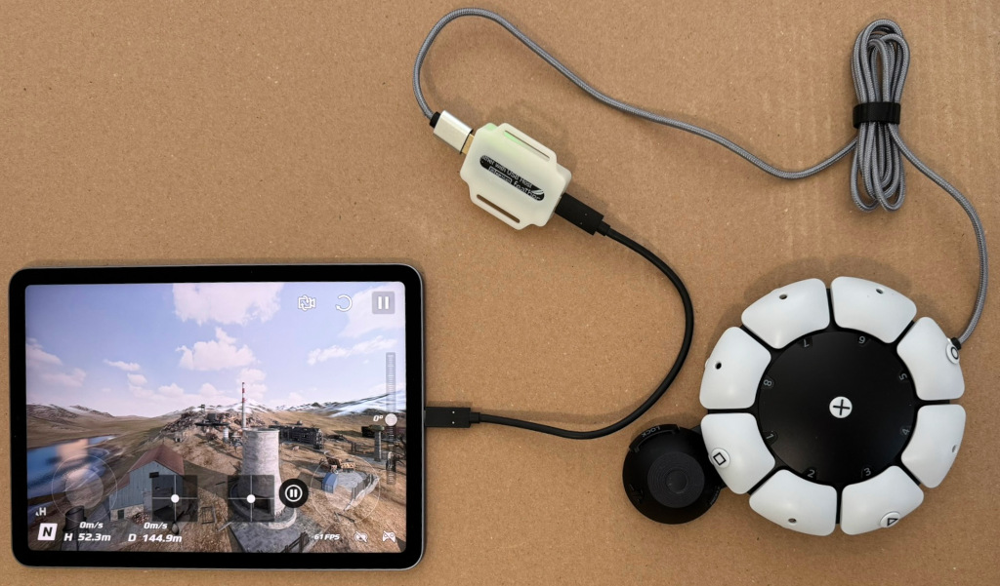
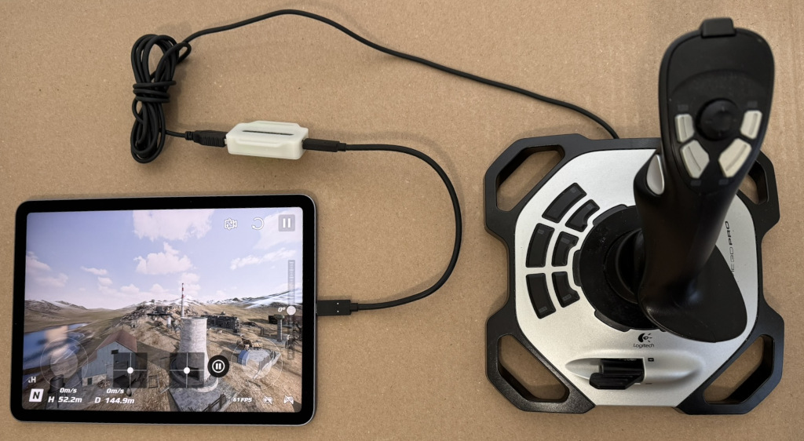
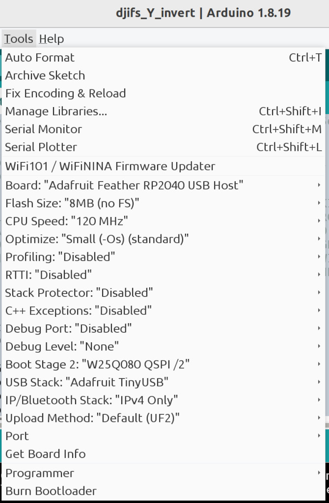

# DJI Flight Simulator PlayStation Gamepad Mixer

[DJI Virtual Flight app with ps4 controller](https://forum.dji.com/thread-278447-1-1.html)

The DJI Flight Simulator (DJIFS) app is for DJI users to learn how to fly DJI
drones. But it can be used without DJI equipment to learn how to fly. Flying
can be done using the touchscreen interface but using a gamepad is much better.
DJIFS supports PlayStation and Xbox controllers. This project only covers DJIFS
on iPad and iPhone using PlayStation controllers.

The DJI Flight Simulator on iPad works great except when using a PlayStation
gamepad controller the left and right stick Y axes are inverted. This project
creates a USB adapter that fixes this problem. The controllers must be
connected via USB, not Bluetooth. In addition, this project can be used to
experiment with accessible controllers.

The PS4 DualShock 4, the PS5 DualSense, and the PS5 Access controllers are
supported. The Access controller is for anyone that has difficulty using
standard controllers.

The Sony Access Controller (SAC) has large buttons and a large joystick. A
second joystick can be plugged into one of its expansion ports. If a second
joystick cannot used, press the PlayStation circle button to swap the left and
right sticks. This feature is handled inside the the USB adapter, not the DJI
software. The single SAC joystick can control both DJI joysticks one at a time.

The Y axis is inverted in remote control modes 1 and 3. If using mode 2 this
project is not needed. As far as I can see from a little time testing, DJIFS on
iPhone has the same Y axis inversion problem.

As an experiment, the Logitech Extreme 3D Pro flight joystick is also
supported. This may help one handed pilots.

## Prepare the USB Adapter

* Adafruit Feather RP2040 with USB Type A Host
* Snap-on Enclosure for Adafruit Feather RP2040 USB Host

Put the RP2040 board in firmware update mode by pressing and holding the BOOT
button then pressing and releasing the RESET button. Then release the BOOT
button. A USB flash drive should appear named RPI-RP2.

Drag and drop the [djifs_Y_invert.ino.adafruit_feather_usb_host.uf2 UF2
file](https://github.com/controllercustom/djifs_Y_invert/releases/download/v2025-02-05/djifs_Y_invert.ino.adafruit_feather_usb_host.uf2)
on the RPI-RP2 drive.  After a few seconds, the drive disappears indicating the
update is done. The adapter is ready to use.

## Prepare the SAC (optional)

To configure the SAC, use a PlayStation 5 or [this web site](https://www.jfedor.org/ps-access/).

When shipped from the factory, most of the SAC buttons do not work so this is
required to use all buttons and expansion input jacks.

## Building from source code

### Arduino IDE Setup

Adafruit provides a tutorial on installing the Arduino IDE for this board.

https://learn.adafruit.com/adafruit-feather-rp2040-with-usb-type-a-host/arduino-ide-setup

### Libraries

Install the following libraries using the IDE Library manager.

* "Adafruit TinyUSB Library" by Adafruit
* "Pico PIO USB" by sekigon-gonnoc

Install the following libraries from github.com by downloading zip files
then installing them using the IDE Library manager "Install .ZIP library" option.

* https://github.com/controllercustom/dsgamepad_tinyusb

### Build Options

The following are the options that must be changed.

* Set "Board" to "Adafruit Feather RP2040 USB Host"
* Set "CPU Speed" to 120 MHz.
* Set "USB Stack" to "Adafruit TinyUSB".

